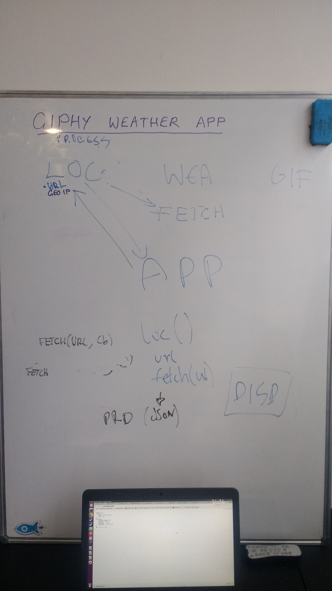
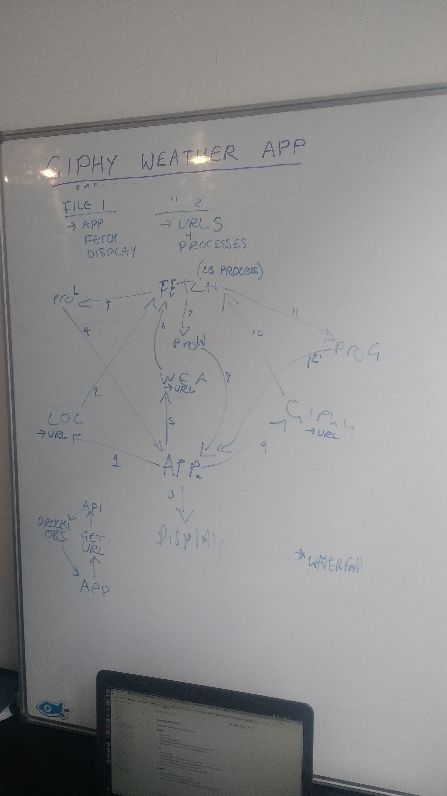

# API week project

Live version: https://fac10.github.io/week3-jzlp/

## Introduction

- Simply put, this app returns a GIF that represents the weather in your area.

### APIs Needed

- Giphy
- OpenWeather
- Nekudo (geolocation)

### Architecture

- Draw diagram showing individual components

  Initial app architecture<br>
    

  Final app architecture<br>
    

- Discuss how individual components will work together

### Considering your user journey

- As a person who needs to know the weather, I want to go to a web page and see the weather in my area
- As an impatient person, I don't want to have to input anything
- As a person who likes gifs, I would like to see a gif

### Stretch goal
- Have a search bar to check the weather somewhere else (i.e. search by city)

---

## Day One

- We decided on our user stories; we wanted to build something where requests for information (APIs) happen sequentially, each relying on information from the previous one.
- We drafted our code architecture together...
- Ultimately, we guesstimated that a waterfall function would be the right methodology to use.
- We did a technical spike to see if this was a viable option. Here is a template to demonstrate the logic:

```
fetch function(){
  //do the api request
}

function getLocation(x, cb) {
  //this is where you pass the url to your fetch function, which returns locationObject, then you extract data
    return cb(null, x + 'location');
  }

function getWeather(x, cb) {
    return cb(null, x + 'weather');
  }

function getGif(x, cb) {
    return cb(null, x + 'gif');
  }


//define waterfall function

function waterfall(arg, tasks, cb) {

  if(tasks.length>0){ //i.e. if there are still tasks to complete
    tasks[0](arg, function(error, result){ //call the first function in the tasks array
    tasks.shift(); //remove that function from the array tasks
    return waterfall(result, tasks, cb) //repeat waterfall passing result from previous function
    });
  }
  else {
    cb(null, arg) //once there are no tasks left to complete, call cb (see below)
  }
}

//call the waterfall function

waterfall('process', [
  getLocation,
  getWeather,
  getGif
],

//cb below
function(error, result) {
  console.log(result);
});
```

- Based on the technical spike, we were able to start writing a waterfall function which was in keeping with our architectural design.
- In conjunction with this, we are starting to write tests.
